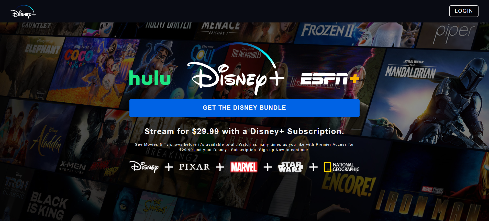
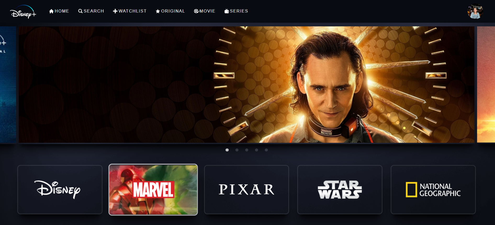
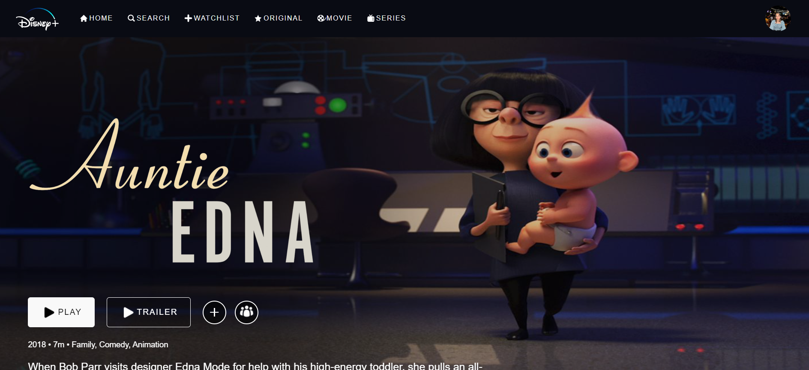

<!-- PROJECT LOGO -->
<br />
<p align="center">
  <a href="https://github.com/github_username/repo_name">
    
  </a>

  <h2 align="center">React Disney Plus Clone</h2>

  <p align="center">
    A Front-end Clone of Disney Plus
    <br />
    <a href="https://github.com/Ayush6501/react-disneyplus-clone"><strong>Explore the docs »</strong></a>
    <br />
    <br />
    <a href="https://react-disneyplus-clone-a6501.firebaseapp.com/">View Demo</a>
    ·
    <a href="https://github.com/Ayush6501/react-disneyplus-clone/issues">Report Bug</a>
    ·
    <a href="https://github.com/Ayush6501/react-disneyplus-clone/issues">Request Feature</a>
  </p>
</p>


<!-- TABLE OF CONTENTS -->
<details open="open">
  <summary><h2 style="display: inline-block">Table of Contents</h2></summary>
  <ol>
    <li>
      <a href="#about-the-project">About The Project</a>
      <ul>
        <li><a href="#built-with">Built With</a></li>
      </ul>
    </li>
    <li>
      <a href="#getting-started">Getting Started</a>
      <ul>
        <li><a href="#prerequisites">Prerequisites</a></li>
        <li><a href="#installation">Installation</a></li>
      </ul>
    </li>
    <li><a href="#screenshots">Screenshots</a></li>
    <li><a href="#inspiration">Inspiration</a></li>
    <li><a href="#license">License</a></li>
    <li><a href="#contact">Contact</a></li>
  </ol>
</details>


<!-- ABOUT THE PROJECT -->
## About The Project

This is a front-end clone of Disney+, with additional authentication features using firebase which'll allow users
to login with their Google credentials to look at this 1-1 beautiful clone.

### Built With

* React
* React Router
* Firebase
* Styled Components


<!-- GETTING STARTED -->
## Getting Started

To get a local copy up and running follow these simple steps.

### Prerequisites

This is an example of how to list things you need to use the software and how to install them.
* npm
  ```sh
  npm install npm@latest -g
  ```

### Installation

1. Clone the repo
   ```sh
   git clone https://github.com/Ayush6501/react-disneyplus-clone.git
   ```
2. Install NPM packages
   ```sh
   npm install
   ```


<!-- SC EXAMPLES -->
## Screenshots

1. The Login Page

2. Home Page

3. Movie Page



<!-- Inspiration -->
## Inspiration

The Original site can be found at <a href="https://www.google.com/url?sa=t&rct=j&q=&esrc=s&source=web&cd=&cad=rja&uact=8&ved=2ahUKEwjSl-vr2-DyAhUBU30KHRRVCaAQFnoECAgQAQ&url=https%3A%2F%2Fwww.disneyplus.com%2F&usg=AOvVaw0e4Kl8rgYSxck8B7OiKpHS">Here</a>.


<!-- CONTRIBUTING -->
## Contributing

Contributions are what make the open source community such an amazing place to learn, inspire, and create. Any contributions you make are **greatly appreciated**.

1. Fork the Project
2. Create your Feature Branch (`git checkout -b feature/AmazingFeature`)
3. Commit your Changes (`git commit -m 'Add some AmazingFeature'`)
4. Push to the Branch (`git push origin feature/AmazingFeature`)
5. Open a Pull Request


<!-- LICENSE -->
## License

Distributed under the MIT License. See `LICENSE` for more information.


<!-- CONTACT -->
## Contact

Ayush Majumdar - [@email](ayushmajumdar6501@gmail.com)

Project Link: https://github.com/Ayush6501/react-disneyplus-clone

Website Link: https://react-disneyplus-clone-a6501.firebaseapp.com/

